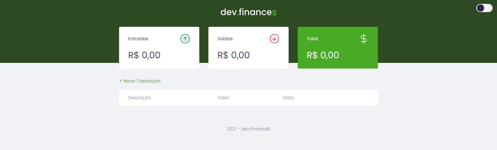

# maratona-discover
 Maratona discover da Rocketseat com o professor Mayk

 **As tecnologias usadas para a construção desse site foram:** 

* HTML (Linguagem de Marcação)
* CSS (Linguagem de estilo em cascata)
* JavaScript (Linguagem de programação)

Esse site serve para calcular o total com as suas receitas menos as suas despesas. 
Os armazenamentos em sessão do site não ficam salvas.

No canto superior direito, existe um switch para deslizar. Desliza para o site mudar o tema de Light para Dark e vice-versa. Caso o seu navegador já esteja no tema dark, o site automaticamente estará no tema dark.

Para acessar o site, [clique aqui](https://maratona-discover-silk.vercel.app/)